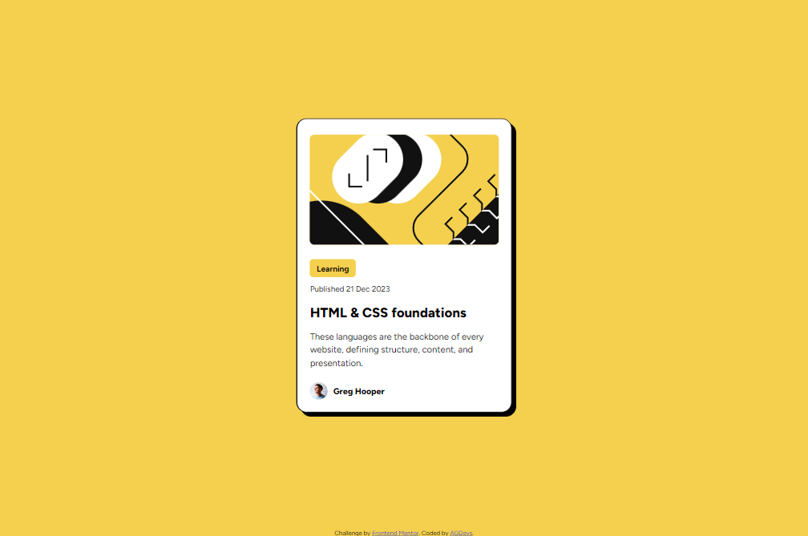
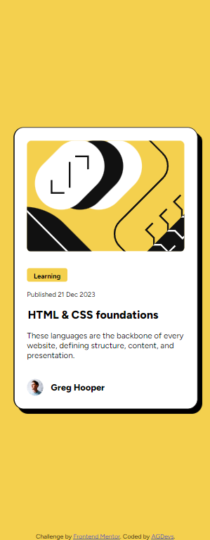

# Frontend Mentor - Blog preview card solution

This is a solution to the [Blog preview card challenge on Frontend Mentor](https://www.frontendmentor.io/challenges/blog-preview-card-ckPaj01IcS). 

## Table of contents

- [Overview](#overview)
  - [The challenge](#the-challenge)
  - [Screenshots](#screenshots)
  - [Links](#links)
- [My process](#my-process)
  - [Built with](#built-with)
- [Author](#author)

**Note: Delete this note and update the table of contents based on what sections you keep.**

## Overview

### The challenge

Users should be able to:

- See hover and focus states for all interactive elements on the page

### Screenshots

### Links

- Solution URL: [Github](https://github.com/8NeoN8/frontEndMasters-blog-preview-card)
- Live Site URL: [Github Page](https://8neon8.github.io/frontEndMasters-blog-preview-card/)

## My process

### Built with

- Semantic HTML5 markup
- CSS custom properties
- Flexbox
- Mobile-first workflow

## Author

- GitHub - [Andres Gonzalez | AGDevs](https://www.github.com/8NeoN8)
- Frontend Mentor - [Andres Gonzalez | AGDevs](https://www.frontendmentor.io/profile/8NeoN8)

